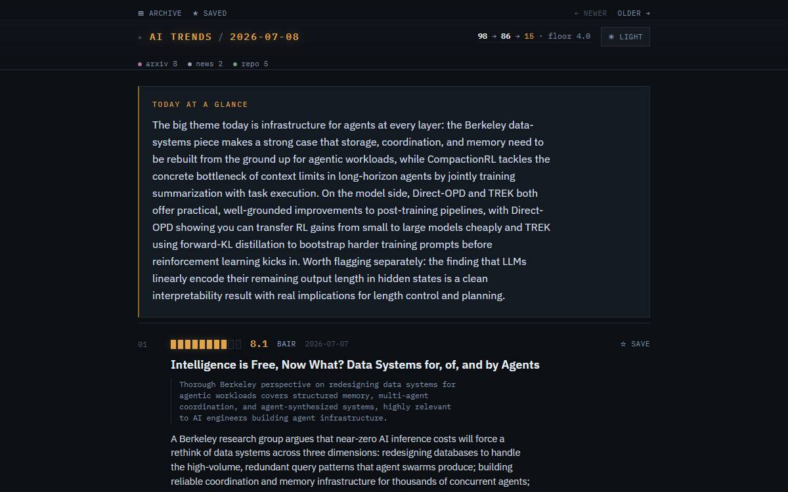
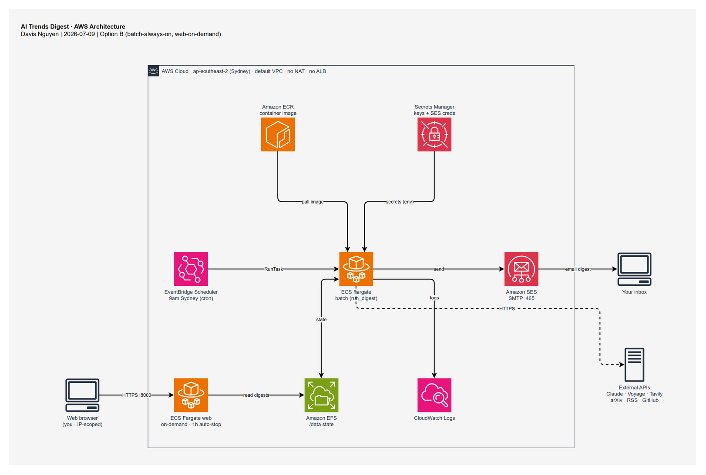
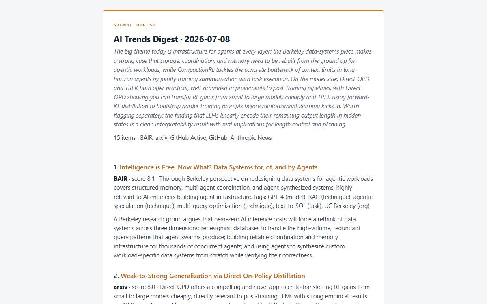

# AI Trends Digest

> A self-running, agentic AI pipeline that collects the day's AI research and news from ~9 sources,
> de-duplicates and remembers across days, ranks and summarizes it with Claude, and **emails you a digest**
> every morning. Click any item and an agentic RAG engine researches it deeper with cited sources. It
> **runs itself on AWS for about $2 to $3 a month.**

<p>
  
  
  
  
  
  
</p>



---

## What it does

- **Collects** from arXiv, curated RSS (Hugging Face, NVIDIA, Google DeepMind, OpenAI, BAIR), the Anthropic
  blog and news, and GitHub (trending plus established-and-active). Each source soft-fails independently.
- **De-duplicates** the same story across sources (exact match, then embedding similarity with a gray-band
  LLM tie-breaker) and **remembers about 14 days**, so it never re-shows old news (suppress, or reframe as
  "Update:").
- **Ranks** every item with Claude on significance, novelty, and relevance (structured output), then
  balances the delivered mix with per-source caps and a score floor.
- **Summarizes** the top items and writes a short "today at a glance" intro.
- **Delivers** a formatted digest by **email** (multipart HTML and text).
- **Deep-dives on demand.** An agentic RAG engine researches any item and returns a **cited** write-up.
- **Runs itself** daily at 9am on AWS, and a web UI can be brought up on demand to browse the archive,
  search, pin items, and trigger deep-dives.

## Why I built this

I wanted a genuinely useful way to keep up with AI without drowning in feeds, so I built the thing I would
actually use every morning. I also used it as a vehicle to go deep on the two areas I care most about:
**agentic RAG** and **shipping to production on AWS**. It is a solo, end-to-end project, from data
collection to a scheduled, self-delivering cloud product.

---

## Architecture

The daily batch runs itself on a schedule; the web UI comes up on demand. Region `ap-southeast-2` (Sydney),
default VPC, with **no NAT Gateway and no load balancer** by design (the two biggest AWS cost traps,
engineered out).



*Editable source: [`aws-architecture.drawio`](assets/aws-architecture.drawio).*

---

## Engineering highlights

### 🤖 Agentic RAG deep-dive (LangGraph)
A cyclic graph (decompose, retrieve, grade, correct, synthesize, reflect) that implements both
**CRAG** (corrective: grade the retrieved docs, re-retrieve if weak) and **Self-RAG** (reflective: critique
the draft, retrieve more if thin). A search and iteration **budget** in both loop-back routers guarantees
termination. Retrieval is seeded with the item's own source, so a same-day preprint cannot drift onto a
look-alike paper. The output is a **cited** write-up.

### 🧠 Cross-source dedup plus cross-day memory (Qdrant + Voyage)
Two passes, cheap before expensive: exact URL/id match, then embedding clustering with a **gray-band LLM
check** for the ambiguous middle. A rolling ~14-day **Qdrant** vector store means the digest never repeats a
story it already showed; near-duplicates are suppressed or reframed as "Update:".

### 🎯 Structured-output ranking plus delivery balancing
Claude scores each item 0 to 10 on three criteria via **Pydantic structured outputs** (no hand JSON
parsing); a weighted blend sorts them, then per-source-type caps and a score floor keep the daily mix from
skewing to papers.

### ☁️ Self-running on AWS (about $2 to $3 a month)
A **Fargate task** (not an always-on service) triggered by **EventBridge Scheduler**, state on **EFS**,
secrets in **Secrets Manager** injected as env, email via **SES over SMTP**, and logs to **CloudWatch**. A
**public-IP, no-NAT** network path plus a **no-ALB, on-demand** web task (1-hour auto-stop, IP-scoped
firewall) keep it near the cost floor.

### 🧪 Engineering craft
**223 tests, all keyless.** External calls sit behind injectable seams, so the whole suite runs with no API
keys and no network, built test-first. A consistent **purity split** (pure core, I/O at the edges, one
external call per seam), **universal soft-fail** (one broken source or channel never breaks the run), and
**LangSmith** tracing with per-stage token and cost.

---

## Tech stack

| Area | Tools |
|---|---|
| **LLM / AI** | Anthropic Claude (summarize, rank, tag, grade), Voyage embeddings, Tavily web search |
| **Agentic RAG** | LangGraph (CRAG + Self-RAG), LangSmith tracing |
| **Data / memory** | Qdrant (vector store), NumPy, Pydantic |
| **Backend / web** | FastAPI, Uvicorn, Jinja2, markdown-it-py |
| **Infra** | Docker + Compose, AWS (ECS Fargate, EventBridge Scheduler, EFS, Secrets Manager, SES, ECR, CloudWatch) |
| **Tooling** | pytest (223 tests), python-dotenv |

---

## Screenshots

| The daily digest (web UI) | The emailed digest |
|---|---|
|  |  |

*Left: the dark "Signal Console" web UI, showing the masthead, the collect → curate → deliver funnel
(98 → 86 → 15), per-item score pips, and the "today at a glance" intro. Right: the same digest delivered as
a multipart HTML and plain-text email.*

---

## Run it locally

**Prerequisites:** Python 3.11 (or Docker). An Anthropic API key is required; Voyage, Tavily, and GitHub keys
are optional (features degrade gracefully without them).

```bash
git clone https://github.com/NhatNguyen3001/ai-trends-digest.git
cd ai-trends-digest
cp .env.example .env          # add your ANTHROPIC_API_KEY (others optional)

# Option A: Docker (app + Qdrant)
docker compose up             # web UI at http://localhost:8000

# Option B: local Python
python -m venv .venv && .venv/Scripts/activate   # (Windows) or: source .venv/bin/activate
pip install -r requirements.txt
python scripts/run_digest.py  # generate a digest
python scripts/serve_web.py   # browse it at http://localhost:8000
```

Run the tests (no keys needed):
```bash
pytest -q
```

---

## Deployment

The batch runs as a scheduled **Fargate task** (EventBridge Scheduler, 9am Sydney), with state on **EFS**,
secrets in **Secrets Manager**, and delivery via **SES**. The web UI is brought up on demand as a
short-lived Fargate task (no load balancer, 1-hour auto-stop, IP-scoped). Total AWS cost is about **$2 to $3
a month**; a NAT Gateway (about $32/mo) and an always-on web plus ALB (about $18/mo) are both designed out.

---

## Limitations and what's next

Built honestly. Here is what it does not do yet:

- **Single-user by design.** Pins and the taste signal are personal; there is no multi-tenant auth.
- **Email goes to a verified address** (SES sandbox), which is ideal for a personal digest but not a mailing
  list.
- **The web UI is not a 24/7 public URL.** It is brought up on demand to keep cost near zero (the
  screenshots above stand in for a live link).
- **Deep-dive retrieval is web-first and ephemeral.** I deliberately deferred a persistent knowledge graph,
  because there is no stable corpus to index.
- **The OpenReview signal is sparse.** Most fresh preprints have no review record yet, so it is a bonus
  signal on the reviewed minority rather than broad coverage.

**Next:** wire the pin-based taste profile into ranking as pins accumulate, add a small evaluation harness,
and optionally a hosted web tier.

---

## About me

**Davis Nguyen**, building AI systems end-to-end.

- GitHub: [@NhatNguyen3001](https://github.com/NhatNguyen3001)
- LinkedIn: [davisnguyen3001](https://www.linkedin.com/in/davisnguyen3001/)
